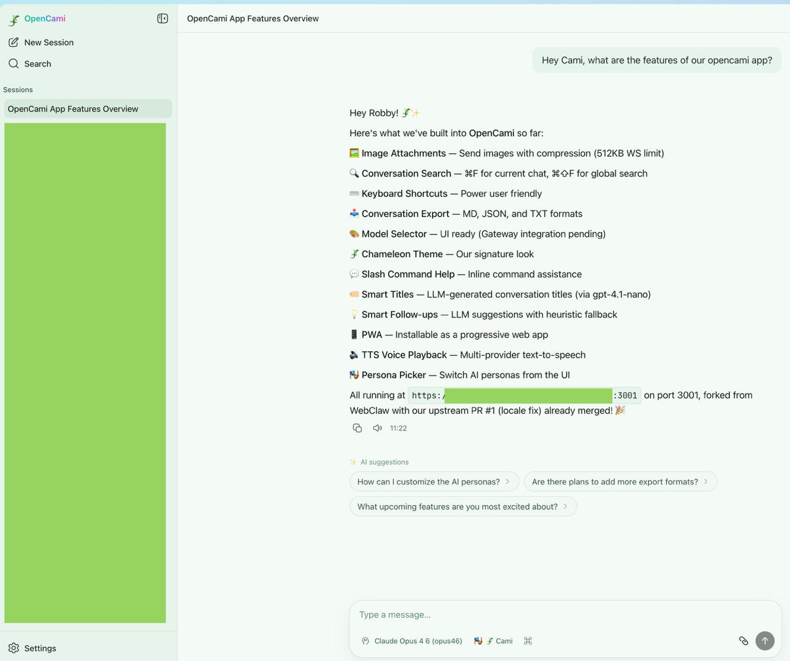

# OpenCami 🦎

A beautiful web client for [OpenClaw](https://github.com/openclaw/openclaw).

[](https://www.npmjs.com/package/opencami)
[](LICENSE)



## Install

### Option 1 (recommended)

```bash
curl -fsSL https://opencami.xyz/install.sh | bash
```

### Option 2

```bash
npm install -g opencami
```

## Run

### ✅ Recommended (OpenCami runs on the same machine as the OpenClaw Gateway)

```bash
opencami --gateway ws://127.0.0.1:18789 --token <GATEWAY_TOKEN>
```

Then open: `http://localhost:3000`

### 🌐 Remote access over Tailscale (keep Gateway local)

This is the safest setup: **Gateway stays on loopback**, you access **OpenCami** via `https://<magicdns>:<port>`.

1) In OpenClaw, allowlist the exact OpenCami URL (**no trailing slash**):

```json5
{
  "gateway": {
    "controlUI": {
      "allowedOrigins": ["https://<magicdns>:3001"]
    }
  }
}
```

2) Restart the gateway:

```bash
openclaw gateway restart
```

3) Start OpenCami with the same origin:

```bash
opencami \
  --gateway ws://127.0.0.1:18789 \
  --token <GATEWAY_TOKEN> \
  --origin https://<magicdns>:3001
```

> ⚠️ Note: `--gateway` must be `ws://` or `wss://` (not `https://`).

## CLI options

```text
opencami [--port <n>] [--host <addr>] [--gateway <ws(s)://...>] [--token <token>] [--password <pw>] [--origin <url>] [--no-open]

--port <n>        Port to listen on (default: 3000)
--host <addr>     Host to bind to (default: 127.0.0.1)
--gateway <url>   OpenClaw gateway WS URL (default: ws://127.0.0.1:18789)
--token <token>   Gateway token (sets CLAWDBOT_GATEWAY_TOKEN)
--password <pw>   Gateway password (sets CLAWDBOT_GATEWAY_PASSWORD)
--origin <url>    Origin header for backend WS (sets OPENCAMI_ORIGIN)
--no-open         Don't open browser on start
-h, --help        Show help
```

## Configuration

You can also set env vars instead of flags:

```bash
CLAWDBOT_GATEWAY_URL=ws://127.0.0.1:18789
CLAWDBOT_GATEWAY_TOKEN=...
OPENCAMI_ORIGIN=https://<magicdns>:3001   # only needed for remote HTTPS
```

## Troubleshooting (quick)

- **"origin not allowed"** → add the exact URL to `gateway.controlUI.allowedOrigins` *and* pass the same value as `--origin` / `OPENCAMI_ORIGIN` (exact match, no trailing `/`).
- **Pairing required** → approve the device in OpenClaw (`openclaw devices list/approve`).
- **Fallback (only if needed):** `OPENCAMI_DEVICE_AUTH_FALLBACK=1`

---

## Security notes

- Prefer `wss://` for remote connections.
- Prefer token auth (`CLAWDBOT_GATEWAY_TOKEN`) over password.
- Keep `allowedOrigins` minimal (exact origins only, no wildcards).
- Treat `OPENCAMI_DEVICE_AUTH_FALLBACK=true` as temporary compatibility mode.
- Do **not** expose OpenCami directly to the public internet without TLS + access controls.
- For Tailnet deployments, limit Tailnet device/user access.

---

## Troubleshooting

### "origin not allowed"

Cause: gateway rejected browser origin.

Fix:
1. Add origin to `gateway.controlUI.allowedOrigins` (exact match, no trailing `/`)
2. Set identical `OPENCAMI_ORIGIN` (or `--origin`) in OpenCami
3. Restart gateway (`openclaw gateway restart`)

### Missing scope `operator.admin`

Cause: gateway auth succeeded but the device was paired with insufficient scopes.

Fix (v1.8.5+): delete the device identity and let OpenCami re-pair automatically:

```bash
rm ~/.opencami/identity/device.json
# then restart OpenCami — it will re-pair with full scopes
```

### Pairing required / device pending approval

On first connect, OpenCami registers itself as a device on the gateway. Starting with v1.8.5, this happens automatically with full scopes (`operator.admin`, `operator.approvals`, `operator.pairing`) — no manual config required.

If you see a "device pending" error:
```bash
openclaw devices list    # find the pending device
openclaw devices approve <deviceId>
```

After approval, OpenCami reconnects and stores a `deviceToken` for future sessions (no shared token needed).

### Can’t connect to gateway at all

Checks:

```bash
openclaw gateway status
echo "$CLAWDBOT_GATEWAY_URL"
echo "$CLAWDBOT_GATEWAY_TOKEN"
```

Also verify URL scheme (`ws://` local, `wss://` remote).

---

## Docker

```bash
docker build -t opencami .
docker run -p 3000:3000 opencami
```

---

## Features

### 💬 Chat & Communication
- ⚡ **Real-time streaming** — persistent WebSocket + SSE, token-by-token
- 📎 **File attachments** — upload PDFs, text, code, CSV, JSON via attach button or drag & drop (`/uploads/` + `read` tool workflow)
- 📄 **File cards** — uploaded files render as clickable cards (filename, icon, size) and open in File Explorer
- 🖼️ **Image attachments** — drag & drop with compression (images stay Base64 for vision)
- 🔊 **Voice playback (TTS)** — ElevenLabs → OpenAI → Edge TTS fallback
- 🎤 **Voice input (STT)** — ElevenLabs Scribe → OpenAI Whisper → Browser
- 🔔 **Browser notifications** — background tab alerts when assistant replies

### 🧠 Smart Features
- 🏷️ **Smart titles** — LLM-generated session titles
- 💡 **Smart follow-ups** — contextual suggestions after each response
- 🧠 **Thinking level toggle** — reasoning depth (off/low/medium/high) per message
- 🔎 **Search sources badge** — see which search engines were used
- 📊 **Context window meter** — visual token usage indicator

### 🔧 Workspace
- 📂 **File explorer** — browse & edit 30+ file types with built-in editor
- 🧠 **Memory viewer** — browse and edit MEMORY.md and daily memory files
- 🤖 **Agent manager** — create, edit, delete agents from the sidebar
- 🧩 **Skills browser** — discover and install skills from ClawHub
- ⏰ **Cron jobs panel** — manage scheduled automations
- 🔧 **Workspace settings** — toggle each tool on/off in Settings

### 🎨 Customization
- 🎭 **Persona picker** — 20 AI personalities
- 🦎 **Chameleon theme** — light/dark/system with accent colors
- 🔤 **Text size** — S / M / L / XL
- 🔌 **Multi-provider LLM** — OpenAI, OpenRouter, Ollama, or custom

### 📁 Organization
- 📁 **Session folders** — grouped by kind (chats, subagents, cron, other)
- 📌 **Pin sessions** — pinned always on top
- 🗑️ **Bulk delete** — select multiple sessions, delete at once
- 🛡️ **Protected sessions** — prevent accidental deletion
- 📥 **Export** — Markdown, JSON, or plain text

### 📱 Platform
- 📱 **PWA** — installable, offline shell, auto-update
- 🖥️ **Tauri desktop app** (Beta) — native wrapper for macOS/Windows/Linux
- ⌨️ **Keyboard shortcuts** — full power-user navigation
- 💬 **Slash commands** — inline help and actions
- 🔍 **Conversation search** — current (⌘F) and global (⌘⇧F)

## Development

```bash
git clone https://github.com/robbyczgw-cla/opencami.git
cd opencami
npm install
cp .env.example .env.local
npm run dev
```

Then open the URL printed by Vite in your terminal.

> Dev port notes: this repo's `npm run dev` script uses port `3002`. If you run Vite directly with the config default, it targets `3003` and auto-falls back to the next free port.

## 🖥️ Desktop App (Tauri)

> **Note:** The desktop app is experimental and under active development. The primary focus of OpenCami is the **web app**. Native builds (desktop & mobile) are secondary.

OpenCami can also run as a native macOS/Windows/Linux desktop wrapper built with Tauri v2. The app loads your self-hosted OpenCami web instance.

### Prerequisites

- Node.js 18+
- Rust toolchain (`rustup`)

### Build

```bash
# Install dependencies (if not already done)
npm install

# Build web assets first
npm run build

# Build desktop app
npm run tauri:build
```

### Custom Gateway URL

By default, the desktop app connects to `http://localhost:3003`.

To override at build time:

```bash
OPENCAMI_REMOTE_URL="https://your-server.example.com" npm run tauri:build
```

### Output

Built installers/bundles are written to `src-tauri/target/release/bundle/`:
- macOS: `.app`, `.dmg`
- Windows: `.exe`, `.msi`
- Linux: `.deb`, `.AppImage`

### Desktop Features

- Tray icon (hide to tray on close)
- Native notifications
- Auto-start on login
- Custom titlebar
- Multiple windows (⌘N)
- Clipboard integration

### Dev Mode

```bash
npm run tauri:dev
```

Requires a display/GUI environment.

## Documentation

- [Features](docs/features.md)
- [Desktop App (Tauri)](docs/desktop-app.md)
- [Architecture](docs/architecture.md)
- [Deployment](docs/deployment.md)
- [FAQ](docs/faq.md)
- [Contributing](docs/contributing.md)
- [Changelog](https://github.com/robbyczgw-cla/opencami/blob/main/CHANGELOG.md)

## Credits

Built on top of [WebClaw](https://github.com/ibelick/webclaw) by [@ibelick](https://github.com/ibelick).

### Contributors

- [@maciejlis](https://github.com/maciejlis) — Dark mode palette, dark mode visibility fixes, metadata stripping improvements
- [@balin-ar](https://github.com/balin-ar) — File Explorer ([upstream PR #2](https://github.com/ibelick/webclaw/pull/2))
- [@deblanco](https://github.com/deblanco) — Dockerfile ([upstream PR #7](https://github.com/ibelick/webclaw/pull/7))

Powered by [OpenClaw](https://github.com/openclaw/openclaw).

## Links

- 🌐 [opencami.xyz](https://opencami.xyz)
- 📦 [npm](https://www.npmjs.com/package/opencami)
- 💻 [GitHub](https://github.com/robbyczgw-cla/opencami)

## License

[MIT](LICENSE)
